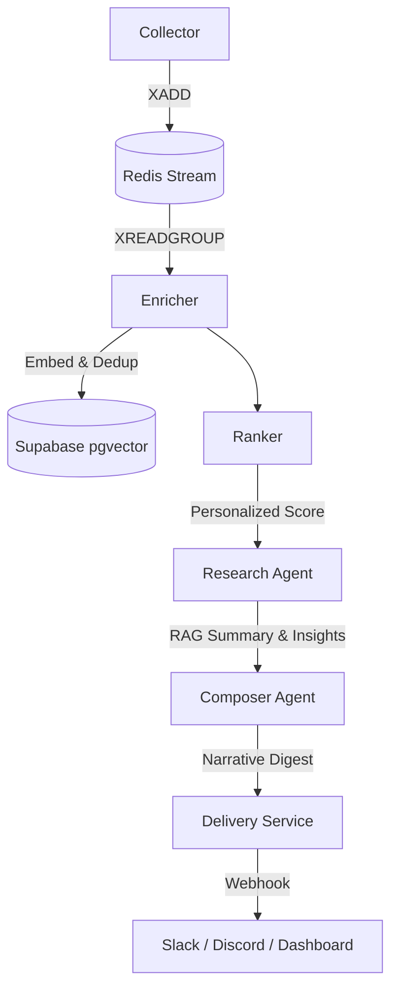

# TechPulse AI 🤖

### *Your intelligent tech pulse, curated by Agentic AI.*

TechPulse AI is a high-performance, automated tech intelligence system designed for developers and AI enthusiasts. It monitors top-tier tech sources, filters the noise using intelligent heuristics and semantic search, and delivers concise, high-value narrative digests directly to Slack and Discord.

The system is architected for **zero-cost operation**, leveraging free-tier services (Groq, Upstash, Supabase) and optimized for minimal resource consumption. TechPulse AI V2 brings semantic memory, novelty detection, and agentic curation to your daily digest.

---

## 🔥 Key Features

- **🚀 Agentic Architecture**: A full five-stage pipeline (Collect → Enrich → Rank → Research → Compose → Deliver) powered by LLMs.
- **🧠 Personalized AI Digests**: Uses Groq (Llama 3 & LangGraph) to summarize articles and distill "Why It Matters", categorized into dynamic themes.
- **🛡️ Semantic Memory & Novelty**: Utilizes pgvector (HNSW) to detect duplicate stories semantically and ensure high novelty in your daily digest.
- **🚀 Efficiency First**: Asynchronous batch processing and Redis Consumer Groups ensure high throughput with minimal resource overhead.
- **🎛️ Multi-Tenant & Super Admin**: Secure RBAC powered by Supabase RLS, with a dedicated Super Admin Dashboard for telemetry and tenant oversight.
- **⚡ Dual CLI System**: Dedicated tools for **Operators** (`techpulse-ops`) and personal **Users** (`techpulse`).

---

## 🏗️ Technical Architecture



---

## 🛠️ Technology Stack

- **Framework**: Python 3.12+ (Asyncio, Pydantic, Loguru, LangGraph)
- **Dependency Management**: [uv](https://github.com/astral-sh/uv)
- **Inference & Embeddings**: Groq (Llama models & nomic-embed-text)
- **Database**: Supabase (PostgreSQL with pgvector)
- **Stream/De-duplication**: Upstash Redis
- **Deployment**: GitHub Actions (Scheduled CRON runs)

---

## 🚀 Getting Started

### 1. Prerequisites
- Python 3.12+ and `uv` installed.
- API keys for: Groq, Supabase, and Upstash Redis.
- Slack or Discord Webhooks (Optional).

### 2. Setup
Clone the repo and install dependencies:
```bash
uv sync
```

### 3. Database Migration
1. Apply the consolidated schema in your Supabase SQL Editor: [setup_supabase.sql](file:///home/vishnu/worklab/techpulse-ai/migrations/setup_supabase.sql).
2. (Optional) Run the study file for ETag support if you wish to implement it later: [009_smart_refresh.sql](file:///home/vishnu/worklab/techpulse-ai/migrations/009_smart_refresh.sql).

### 4. Environment Config
Create a `.env` file from the following template:
```env
SUPABASE_URL=your_url
SUPABASE_KEY=your_service_role_key      # Required for techpulse-ops
SUPABASE_ANON_KEY=your_anon_public_key  # Required for techpulse (User CLI)
GROQ_API_KEY=your_key
GROQ_MODEL=llama-3.1-8b-instant
UPSTASH_REDIS_REST_URL=your_url
UPSTASH_REDIS_REST_TOKEN=your_token
TOP_N_ARTICLES=10
DEDUP_TTL_DAYS=7
COLLECTION_INTERVAL_DAYS=14             # How far back to look (default 14 days)
```

### 5. Running Locally

**System Pipeline (Operator)**:
```bash
make pipeline
# OR
uv run techpulse-ops run all
```

---

## ⚡ Command Line Power Tools

TechPulse comes with two dedicated CLI tools.

### 🛠️ Operator CLI (`techpulse-ops`)
For system-level management and automation (bypasses RLS).
```bash
# Run the pipeline
uv run techpulse-ops run collect
uv run techpulse-ops run summarize

# Monitor system health
uv run techpulse-ops monitor

# List all tenants
uv run techpulse-ops tenants list
```

### ⚡ User CLI (`techpulse`)
For personal management of your own feeds and filters (enforces RLS).
```bash
# Login to your account
uv run techpulse login

# Manage your sources
uv run techpulse sources list
uv run techpulse sources import my_feeds.txt

# Inspect status
uv run techpulse status
```

---

## 🧹 Maintenance & Testing

### Master Storage Reset
To wipe all Redis streams, deduplication data, and database history:
```bash
PYTHONPATH=src uv run python -m shared.maintenance reset --confirm
```

### Standardized Testing
To verify the entire logic and pipeline using `pytest`:
```bash
PYTHONPATH=src uv run pytest
```

---

## 📜 License
MIT License. Feel free to use and contribute!
