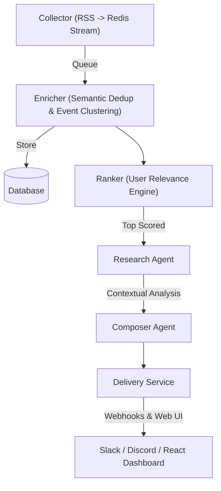

# TechPulse AI 🤖

### *Your personal tech intelligence system, curated by Agentic AI.*

TechPulse AI goes beyond being an automated news pipeline. It is a **personal tech intelligence system** that remembers context, suppresses repetition, and explains why a development matters to *you* specifically before it ever sends an alert. 

Currently, the project is structured around localized collection, AI summarization, multi-tenant personalization, and scheduled delivery across Slack, Discord, and the web. The overarching objective is to answer a single question: **"Tell me only what changed, why it matters, and what I should watch next."**

---

##  Highest-Impact Upgrades

TechPulse AI V2 introduces next-level features tailored for RAG-based personalized news workflows that emphasize recency, grounding, and user-specific relevance over raw volume:

- **Intelligent Deduplication & Novelty Tracking**: By analyzing the actual meaning of articles, TechPulse suppresses "same story, new headline" repeats and surfaces genuinely novel developments.
- **Memory over Past Coverage**: The system retrieves related history for every incoming article. Summaries are therefore aware of past coverage, tracking *how* a story evolved instead of just treating it as an isolated event.
- **Personalized Interest Model**: A dynamic scoring engine learns real user priorities by mixing explicit topic filters with implicit quality scores, measuring both engagement and source reliability.
- **Narrative Digest Composer**: Instead of listing isolated links, the system composes a decision-ready narrative brief grouped logically into key themes (e.g., Generative AI, Security, Industry).

---

## 🏗️ Technical Architecture & Pipeline

TechPulse AI extends its robust backend backbone to incorporate true agentic capabilities. The flow runs as follows: **Collect → Semantic Dedup → Event Clustering → Retrieve Related History → Summarize ("What happened / Why it matters") → Rank by User Relevance → Compose Digest → Deliver**.



---

## 💻 Web App & User Experience

The backend supports an advanced frontend UI (`techpulse-web`) bridging authentication, settings, and multi-tenant management. Moving forward, the product expands into three core user-facing views:

1. **Morning Brief Page**: A beautifully rendered, theme-grouped narrative digest built dynamically for the user.
2. **Ask TechPulse**: A semantic search bar over the custom article archive, allowing users to query past intelligence by meaning rather than exact keywords.
3. **Radar View**: A visual telemetry board showing emerging themes, recurring companies, and "quiet but growing" topics across recent coverage.

---

## 🛠️ Technology Stack

- **Framework**: Python 3.12+ (Asyncio, Pydantic, Loguru, LangGraph)
- **Dependency Management**: [uv](https://github.com/astral-sh/uv)
- **Inference & Embeddings**: Groq (Llama-3.3-70b-versatile, Llama-3.1-8b-instant), Sentence-Transformers (`all-mpnet-base-v2`)
- **Database**: Supabase (PostgreSQL with pgvector for HNSW indexing)
- **Stream/De-duplication**: Upstash Redis REST
- **Deployment**: Local execution or server chron targeting Slack/Discord webhooks

---

## 🚀 Getting Started

### 1. Prerequisites
- Python 3.12+ and `uv` installed.
- API keys for: Groq, Supabase, and Upstash Redis.
- Supabase Project with `vector` extension enabled.

### 2. Setup
Clone the repo and install dependencies:
```bash
uv sync
```

### 3. Database Migration
Apply the V2 schema changes in your Supabase SQL Editor required for Semantic Dedup and RAG tracking found in the `migrations/` directory. Be sure the `articles` table has the `is_delivered` boolean column and the pgvector extension is turned on.

### 4. Environment Config
Create a `.env` file from the following template:
```env
SUPABASE_URL=your_url
SUPABASE_KEY=your_service_role_key      # Required for techpulse-ops (Operator)
GROQ_API_KEY=your_key
UPSTASH_REDIS_REST_URL=your_url
UPSTASH_REDIS_REST_TOKEN=your_token
TOP_N_ARTICLES=10
DEDUP_TTL_DAYS=30
COLLECTION_INTERVAL_DAYS=14
```

### 5. Running the AI Pipeline

Everything has been aggregated into a single operational script that handles concurrent execution:

```bash
uv run techpulse-ops run all
```

---

## ⚡ Command Line Power Tools

TechPulse comes with two dedicated CLI tools.

### 🛠️ Operator CLI (`techpulse-ops`)
For system-level management, orchestration, and automation.
```bash
# Run the pipeline
uv run techpulse-ops run all
uv run techpulse-ops run collect

# Monitor system health (live)
uv run techpulse-ops monitor

# View tenant statistics and pipeline health
uv run techpulse-ops tenants list
uv run techpulse-ops tenants stats
```

### ⚡ User CLI (`techpulse`)
For personal management of your own feeds and filters (enforces RLS and requires `SUPABASE_ANON_KEY`).
```bash
# Login to your account
uv run techpulse login

# Manage your sources
uv run techpulse sources list
uv run techpulse sources import my_feeds.txt
```

---

## 🧹 Maintenance & Testing

### Master Storage Reset
To wipe all Redis streams, embeddings, and database history cleanly prior to a production launch:
```bash
uv run techpulse-ops reset --confirm
```

### Automated Testing
To verify the entire RAG memory, grouping logic, and pipeline using `pytest`:
```bash
PYTHONPATH=src uv run pytest
```

---

## 📜 License
MIT License. Feel free to use and contribute!
