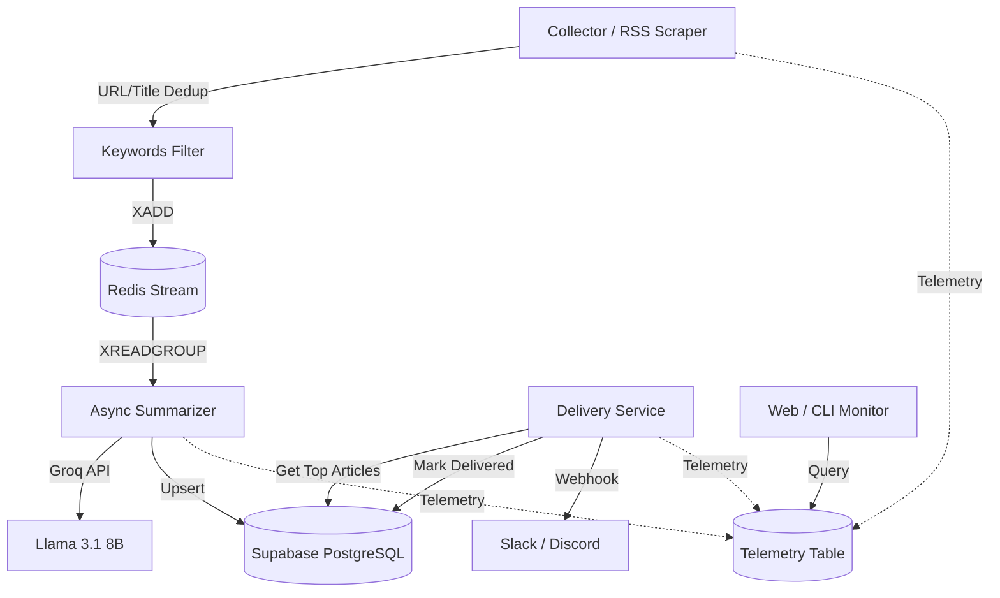

# TechPulse AI 🤖

### *Your intelligent tech pulse, curated by AI.*

TechPulse AI is a high-performance, automated news aggregator designed for developers and AI enthusiasts. It monitors top-tier tech sources, filters the noise using intelligent heuristics, and delivers concise, high-value summaries directly to Slack and Discord.

The system is architected for **zero-cost operation**, leveraging free-tier services (Groq, Upstash, Supabase) and optimized for minimal resource consumption.

---

## 🔥 Key Features

- **🚀 Async Performance**: Refactored with `asyncio` to reduce GitHub Actions execution time by ~70%, saving valuable free-tier minutes.
- **🧠 Zero-Cost Pro Summaries**: Powered by **Groq (Llama-3.1-8b-instant)**. Optimized for high throughput and reliable processing without hitting free-tier rate limits.
- **🔍 Stateful Delivery**: Articles are tracked via an `is_delivered` flag to ensure each high-quality article is sent exactly once, even with multiple daily runs.
- **📊 Health Monitoring**: A dual-layered monitoring system with a **Premium Web Dashboard** (Streamlit) and a **Beautiful CLI Monitor** (Rich).
- **🛡️ Reliable Stream Pipeline**: Uses **Redis Consumer Groups** (`XREADGROUP`/`XACK`) to ensure at-least-once processing. No message is lost if a database or network failure occurs.
- **⚡ Telemetry Logging**: Every run tracks metrics (fetched vs. queued, success vs. failure) to provide full visibility into the system pipeline.
- **proactive Maintenance**: Includes a master "System Reset" tool to easily clear streams and database history for a fresh start.
- **📡 Multi-Channel Delivery**: Formatted Block Kit payloads for Slack and Markdown-optimized chunks for Discord.

---

## 🏗️ Technical Architecture



---

## 🛠️ Technology Stack

- **Framework**: Python 3.12+ (Asyncio, Pydantic, Loguru)
- **Dependency Management**: [uv](https://github.com/astral-sh/uv)
- **Inference**: Groq (Llama-3.1-8b-instant)
- **Database**: Supabase (PostgreSQL)
- **Stream/De-duplication**: Upstash Redis
- **Deployment**: GitHub Actions (Scheduled CRON runs)

---

## 🚀 Getting Started

### 1. Prerequisites
- Python 3.12+ and `uv` installed.
- API keys for: Groq, Supabase, and Upstash Redis.
- Slack or Discord Webhooks (Optional).

### 2. Setup
Clone the repo and install dependencies:
```bash
uv sync
```

### 3. Environment Config
Create a `.env` file from the following template:
```env
GROQ_API_KEY=your_key
GROQ_MODEL=llama-3.1-8b-instant
SUPABASE_URL=your_url
SUPABASE_KEY=your_key
UPSTASH_REDIS_REST_URL=your_url
UPSTASH_REDIS_REST_TOKEN=your_token
SLACK_WEBHOOK_URL=your_url
DISCORD_WEBHOOK_URL=your_url
TOP_N_ARTICLES=10
DEDUP_TTL_DAYS=7
```

### 4. Running Locally
You can run the full pipeline with a single command:
```bash
uv run python -m services.collector.main && \
uv run python -m services.summarizer.main && \
uv run python -m services.delivery.main
```

### 5. Monitoring the Pipeline
You can monitor the system in real-time using either the terminal or a browser:

**Web Dashboard (Recommended)**:
```bash
uv run streamlit run services/monitor/app.py
```

**CLI Heartbeat**:
```bash
uv run python -m shared.monitor --live
```

---

## 🧹 Maintenance & Testing

### Master Storage Reset
To wipe all Redis streams, deduplication data, and database history:
```bash
uv run python -m shared.maintenance reset --confirm
```

### End-to-End Test
To verify the entire pipeline (injection -> summary -> delivery) without waiting for fresh news:
```bash
PYTHONPATH=. uv run python scratch/test_e2e.py
```

---

## 📜 License
MIT License. Feel free to use and contribute!
