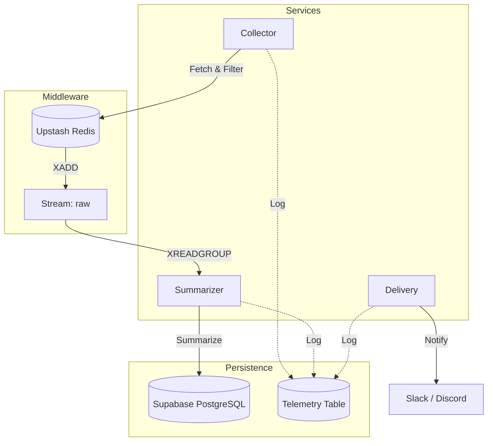

# TechPulse AI: Developer Documentation 🛠️

This document provides a technical deep-dive into the TechPulse AI architecture, data pipeline, and security model.

## 🏗️ Architecture & Data Flow

TechPulse AI follows a **decoupled, event-driven architecture** using Redis Streams as a message broker and Supabase as a persistent multi-tenant store.



### 1. The Collection Pipeline (`Collector`)
The collector runs concurrently across all active RSS sources listed in the `rss_sources` table.
- **Freshness**: Uses a strict publication date cutoff (default 14 days).
- **Deduplication**: Uses Redis for fast URL and title-slug hashing (`seen:{user_id}:{hash}`).
- **Relevance**: Performs an initial keyword match against personal interest profiles before queueing.

### 2. The AI Engine (`Summarizer`)
The summarizer is an asynchronous consumer that drains the Redis Stream.
- **Reliability**: Uses **Redis Consumer Groups**. Workers prioritize *pending* messages (messages sent but not yet acknowledged) before taking new ones. This ensures no article is lost if a worker crashes.
- **Scoring**: Groq LLM (Llama 3) generates a relevance score (0-5).
- **Boosting**: Topics matched against the `priority` list receive a **+1.0 boost** to ensure they appearing in the daily digest.

### 3. Distribution (`Delivery`)
The delivery service groups high-scoring, undelivered articles by tenant.
- **Personalization**: Each user receives a unique digest based on their specific scores.
- **Thematic Grouping**: Articles are clustered into curated themes (e.g., "🧠 Generative AI") using keyword mapping.

---

## 🔒 Multi-Tenant Security Model

TechPulse Pro uses **Supabase Row Level Security (RLS)** to ensure data isolation.

| Table | Policy | Scope |
| :--- | :--- | :--- |
| `articles` | `auth.uid() = user_id` | Users can only see/delete their own news. |
| `app_config` | `auth.uid() = user_id` | Topic settings are private per user. |
| `rss_sources` | `auth.uid() = user_id` | Sources are isolated per tenant. |

### CLI Tool Contexts:
- **`techpulse` (User)**: Authenticates as a specific user. It uses the `anon` key + user JWT. Access is restricted by RLS.
- **`techpulse-ops` (Operator)**: Uses the `service_role` key. It bypasses RLS for system-wide maintenance and pipeline execution.

---

## 🛠️ Development Guidelines

### Coding Standards
- **Logging**: Use `loguru` for all observability. Avoid `print()`.
- **Typing**: Use strict Python type hints (`typing` module) for all function signatures.
- **Models**: Use `Pydantic` for data validation and schema definitions.

### Testing
We use `pytest` for logic verification.
```bash
# Run unit tests
PYTHONPATH=src uv run pytest tests/unit
```

### Resetting the System
During testing, you can wipe the pipeline state:
```bash
uv run techpulse-ops reset --confirm
```
