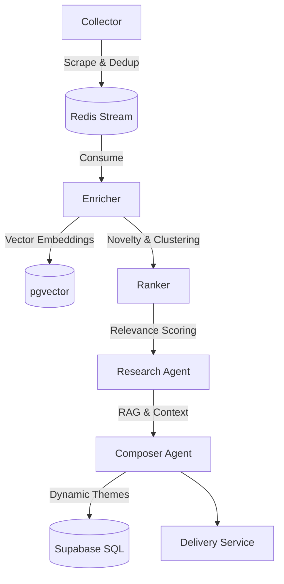

# TechPulse AI: Developer Documentation 🛠️

This document provides a technical deep-dive into the TechPulse AI architecture, data pipeline, and security model.

## 🏗️ Architecture & Data Flow

TechPulse AI V2 transitions from a simple RSS aggregator to an **Agentic Tech Intelligence System**. It uses a pipeline structure defined by five major stages.



### 1. The Collection Pipeline (`Collector`)
The collector runs concurrently across all active RSS sources listed in the `rss_sources` table.
- **Freshness**: Uses a strict publication date cutoff.
- **Deduplication**: Uses Redis for fast URL and title-slug hashing (`seen:{user_id}:{hash}`).
- **Source Health**: Captures metrics on ingestion vs delivery to auto-downgrade noisy feeds.

### 2. The Enrichment Engine (`Enricher`)
- **Embeddings**: Uses Groq `nomic-embed-text` to generate 768-dimensional vectors.
- **Semantic Deduplication**: Checks `pgvector` index via HNSW for near-identical matches to avoid "same story, multiple sources" spam.
- **Novelty Scoring**: Calculates uniqueness against the user's historical feed.

### 3. The Decide & Research Pipeline (`Ranker` & `Research Agent`)
- **Scoring**: Combines base LLM relevance, novelty score, source quality, and explicit user feedback.
- **Research Agent**: Utilizes context retrieval to provide historical insight, ultimately synthesizing a precise summary and extracting the "Why It Matters" takeaway.

### 4. Distribution & Curation (`Composer` & `Delivery`)
- **Dynamic Theming**: The Composer Agent assigns dynamic thematic groupings (e.g. "Generative AI", "Developer Tools") replacing hardcoded taxonomies.
- **Delivery**: High-scoring items are packaged into a narrative morning digest grouped by the AI-assigned themes and sent via webhooks to Slack/Discord.

---

## 🔒 Multi-Tenant Security Model

TechPulse Pro uses **Supabase Row Level Security (RLS)** to ensure data isolation.

| Table | Policy | Scope |
| :--- | :--- | :--- |
| `articles` | `auth.uid() = user_id` | Users can only see/delete their own news. |
| `app_config` | `auth.uid() = user_id` | Topic settings are private per user. |
| `rss_sources` | `auth.uid() = user_id` | Sources are isolated per tenant. |
| `tenant_profiles` | `is_admin` | Drives access to the Super Admin Dashboard. |

### CLI Tool Contexts:
- **`techpulse` (User)**: Authenticates as a specific user. It uses the `anon` key + user JWT. Access is restricted by RLS.
- **`techpulse-ops` (Operator)**: Uses the `service_role` key. It bypasses RLS for system-wide maintenance and pipeline execution, securely managing tenant data.

---

## 🛠️ Development Guidelines

### Coding Standards
- **Logging**: Use `loguru` for all observability. Avoid `print()`.
- **Typing**: Use strict Python type hints (`typing` module) for all function signatures.
- **Models**: Use `Pydantic` for data validation and schema definitions.

### Testing
We use `pytest` for logic verification.
```bash
# Run unit tests
PYTHONPATH=src uv run pytest tests/unit
```

### Resetting the System
During testing, you can wipe the pipeline state:
```bash
uv run techpulse-ops reset --confirm
```
